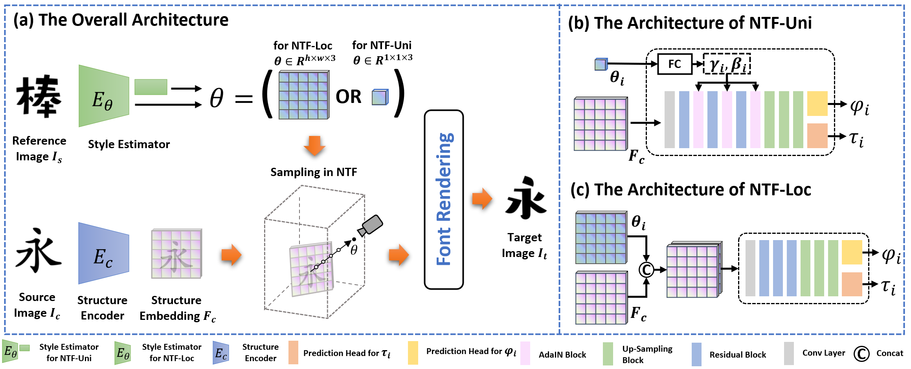

# [CVPR2023] Neural Transformation Fields for Arbitrary-Styled Font Generation
This is the official Pytorch implementation of ***Neural Transformation Fields for Arbitrary-Styled Font Generation***. 

## <center> Neural Transformation Fields for Arbitrary-Styled Font Generation </center>

<center>Bin Fu, Junjun He, Jianjun Wang, Yu Qiao</center>

\
Few-shot font generation (FFG), aiming at generating font images with a few samples, is an emerging topic in recent years due to its academic and commercial values. Typically, the FFG approaches follow the style-content disentanglement paradigm, which transfers the target font styles to characters by combining the content representations of source characters and the style codes of reference samples. Most existing methods attempt to increase font generation ability via exploring powerful style representations, which may be a sub-optimal solution for the FFG task due to the lack of modeling spatial transformation in transferring font styles. In this paper, we model font generation as a continuous transformation process from the source character image to the target font image via the creation and dissipation of font pixels, and embed the corresponding transformations into a neural transformation field. With the estimated transformation path, the neural transformation field generates a set of intermediate transformation results via the sampling process, and a font rendering formula is developed to accumulate them into the target font image. Extensive experiments show that our method achieves state-of-the-art performance on the few-shot font generation task, which demonstrates the effectiveness of our proposed model. 



* * *

## Prerequisites

Since our codes is based on [FFG-benchmarks](https://github.com/clovaai/fewshot-font-generation), installing this benchmark and then putting our code into the corresponding positions is the fastest way to implement our model. 
The code is tested on `Python >= 3.6` (we recommend [conda](https://docs.anaconda.com/anaconda/install/linux/)) with the following libraries

```
torch >= 1.5
sconf
numpy
scipy
scikit-image
tqdm
jsonlib-python3
fonttools
```

## Datasets

In this project, we select the native true-type font (TTF) formats for datasets, which is storage-efficient and easy-to-use. The structure of the dataset is constructed following the instructions from [FFG-benchmarks](https://github.com/clovaai/fewshot-font-generation). 

You can collect your own fonts from the following web site (for non-commercial purpose):

- [https://www.foundertype.com/index.php/FindFont/index](https://www.foundertype.com/index.php/FindFont/index) (acknowledgement: [DG-Font](https://github.com/ecnuycxie/DG-Font) and [FFG-benchmarks](https://github.com/clovaai/fewshot-font-generation) refer this web site)


## Training

### Modify the configuration file

The configuration file: cfgs/NTF/train.yaml
```
- resume: # the resume checkpoint (if available)
- work_dir: # the directory to save checkpoints, validation images, and the log.
```

The configuration file: cfgs/data/train/custom.yaml
```
dset:   # leave blank
  train:   # leave blank
    data_dir:  # The font folder for training
    chars:  # The json file for training characters
    extension: ttf
```

Note that the hyper-parameters are provided in the file: cfgs/NTF/default.yaml, you can modify this file to change parameters. 

### Run training
```
CUDA_VISIBLE_DEVICES=GPUID python train_NTF.py cfgs/NTF/train.yaml cfgs/data/train/custom.yaml
```

## Testing

### Modify the configuration file

The configuration file: cfgs/data/eval/chn_ttf.yaml
```
dset:
  test:
    extension: ttf # extension of training data
    data_dir:  # path to training data
    source_path: data/chn/source.ttf  # path to the source font or source directory to use for the validation.
    source_ext: ttf   # extension of the source data
    ref_chars: # The json file containing the reference characters
    gen_chars: # The json file containing the characters list to generate
```

Note that the hyper-parameters are provided in the file: cfgs/NTF/default.yaml, you can modify this file to change parameters. 

### Run testing
```
CUDA_VISIBLE_DEVICES=GPUID python inference.py cfgs/data/eval/chn_ttf.yaml --model NTF --weight  --result_dir 
```

## Code license

This project is distributed under [MIT license](LICENSE).

## Acknowledgement

This project is based on [FFG-benchmarks](https://github.com/clovaai/fewshot-font-generation).

## How to cite

```
@InProceedings{Fu_2023_CVPR,
    author    = {Fu, Bin and He, Junjun and Wang, Jianjun and Qiao, Yu},
    title     = {Neural Transformation Fields for Arbitrary-Styled Font Generation},
    booktitle = {Proceedings of the IEEE/CVF Conference on Computer Vision and Pattern Recognition (CVPR)},
    month     = {June},
    year      = {2023},
    pages     = {22438-22447}
}
```
